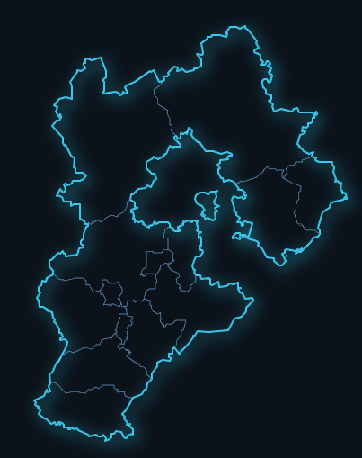

###### <sub>地图可视化实操经验总结</sub><br />Leaflet实现地图可视化<br />──<br /><sup>2021年5月19日</sup><br />`#文档密级|公开分享#`<br /><br />**Alexander Misel**<br />*&copy;本文以CC BY-SA 4.0协议发布*

[TOC]

# 为什么我们最终走上了地图可视化的路

地图可视化是展示包含经纬度数据的最好方式。为什么要可视化？因为大量的数据的空间信息以及地理关联性，通过可视化才能让人直观地了解这些数据。

我们最初做的第一个大屏是基于echarts的。echarts的可视化很炫酷，UI一设计，那效果，可以想象。但有一些问题，比如在echarts中，地理类型只是一个小功能，没有太多与地图相关的工具函数以及坐标转换等，此外，也没有太多针对大量矢量地理信息展现的优化。使用echarts展现的时候，就感觉资源吃得很厉害。所以我们考虑用真正的Web地图来实现地图可视化。Leaflet的学习成本较低，文档清晰明了，也就成为了我们的选择。

# Leaflet实现基本可视化效果

在地图可视化中，我们往往会用到一些地图基本使用以外的功能，比如热力图、轨迹展示、要素聚合、下钻等。此外，除了功能性的需要以外，我们还要在基本的地图元素上面增加可视化效果，让它看起来像一个地图可视化，而非一个普普通通的地图展示。

## 地图可视化的基本操作

为了实现复杂的效果，既不让效果之间互相影响，又能够动态、关联地进行切换，我们就要充分利用Leaflet的两个功能，LayerGroup和pane。万物皆是layer，是Leaflet的一个核心理念。即便一个marker，一个polygon，都属于layer。我们要按照我们的想法，把layer用LayerGroup组织起来，然后动态切换LayerGroup是否放在map上。

何为LayerGroup？LayerGroup是一个能够容纳其他Layer的高级Layer。所以LayerGroup本质也是一个Layer。另外需要明确的是，Leaflet上的Layer具体会对应DOM上的哪个位置其实不是LayerGroup决定的。LayerGroup就像一个虚拟的容纳器，你可以方便地管理Group里的Layer，但你想要从DOM中找到一个LayerGroup，是找不到的。

我们在DOM中实际布局的位置，就是所谓的pane了。Leaflet有一些默认的pane，比如tile、overlay、shadow、marker、tooltip、popup等。大多数元素都会自动加入到默认的pane里面。一般我们不需要改变这一点。我们可以自己创建pane，这特别有用，但我不鼓励在非必要的时候乱建pane。我目前建了两个pane：一个是行政区划的地图，因为我们很多可视化都要用到基础的行政区边界，我不希望它受到其他的影响，就开辟了一个pane；另一个就是下钻的city的pane，因为我在下钻之后还保留一些上层的事件，而这个事件是直接加在map上的，我用了`e.originalEvent.srcElement`的父级是否有city这个class来判断事件是从哪发出来的。

## GeoJSON加阴影实现

在Leaflet中GeoJSON的行政区划边界绘制是使用SVG实现的。因此我们可以通过SVG的效果来实现边界的。



在现代浏览器里面，支持一个SVG filter，叫做feDropShadow，能够非常简单地实现阴影的效果。

```svg
  <svg xmlns="w3.org/2000/svg" version="1.1">
	<defs>
	  <filter id="dropshadow">
	    <feDropShadow dx="4" dy="4" stdDeviation="8" flood-color="#33dcff">
	  </filter>
	</defs>
  </svg>
```

这个效果想要加到我们的GeoJSON效果中，就要在初始化GeoJSON的时候给它一个className，我设置成了`province-boundary`，然后加一个CSS上去

```css
.province-boundary {
  filter: url(#dropshadow);
}
```

就会应用这个SVG效果了。

## 地图下钻

几乎是个地图可视化就会整一个下钻。其实下钻是一个不需要用插件就能实现的功能，用Leaflet自身就能实现。这就需要参考一下Leaflet官网的[Interactive Choropleth Map](https://leafletjs.com/examples/choropleth/)实现。几乎大部分代码都可以照抄。只不过，Choropleth Map点击地市边界的时候，只会缩放到展示地市的区域，没有后续的下钻操作。但这难不倒我们。我们只要修改原本的`zoomToFeature`函数就好了。

在`zoomToFeature`里面，我们在city的pane里面，再画一下地市级别的图不就成了。果然，画完之后就是我想要的效果。我考虑过下钻之后在外部加遮罩层，但我没有那么做，应该也是可行的。我是通过一个变量标记当前下钻的区域。如果在区域内部，或者像我之前说的，从city专门的pane里面发出的event，就不响应就好了。总之，让事件可以被需要处理的层级处理，这个比较关键。

## 动态生成可见要素列表

虽然小标题是动态生成可见要素列表，但其实是用的一个通用的功能，就是quadtree。quadtree是一种便于快速检索的数据结构。尤其对于可视区域的要素检索非常有效。在要素数量相对不多的情况下（根据我的经验，50000个以下一般都可以认为不多），如果需要动态获取可见要素，稍微移动一下就要请求后台接口，这不光费时，还会对后台造成压力，没有必要。

我们在增加marker或者其他要素的时候，要把它相关的数据存在对象里面。这不会影响其他正常功能。就像这样：

```js
theMarker._data = item;
```

然后把它加入到quadtree中。它会自动将数据用四叉树的形式组织起来，方便查询空间范围的重叠情况。使用这个API

```js
var quadtree = L.quadtree(options);
...
var colliders = quadtree.getColliders(bounds);
```

获取到了colliders之后，就去遍历它，然后获取我们事先存好的`_data`，然后生成HTML，实现动态生成列表。可以参考一下[这个demo](https://ibesora.github.io/Leaflet.Quadtree/demos/cullingGeoJSON/demo.html)。

## 用插件就可以实现的功能

- 热力图——用simpleheat
- 轨迹动画——用leaflet-ant-path
- 要素聚合——用leaflet.markercluster
- 百度坐标转换——用proj4leaflet+PRCoords+leaflet-baidu（纠偏）

# 在实现中用到的Leaflet实用技巧

想要用好Leaflet，除了充分查阅文档以外，还有一些小技巧，非常有用。

## 外部列表触发地图上Popup

地图上有各种要素，展示起来很炫目。但是如果只能从地图内部去触发的话，那就限制了可操作性了。从外部列表上触发地图上Marker上的popup，就是一个很典型的案例。我采用的方法是用全局对象来记录Marker，用一个唯一id从这个对象中查询对应的Marker。最简单的写法是这样的：

###### 根据id找到marker并打开它关联的popup

```js
function findMarker(id) {
    let marker = markers[id];
    if (marker) {
        let pos = marker.getLatLng();
        map.panTo(pos);
        // marker.openPopup(); // doesn't work
        map.openPopup(marker._popup, pos);
    }
}
```

因为我们的Marker都位于cluster里面，所以用上面注释掉的`openPopup`无法打开对应Marker的popup。但我尝试后发现可以通过强行找出Marker内部的`_popup`，然后用map的方法打开这个popup。这样的效果是，cluster不会展开，我们的popup会在cluster对应位置显示。但是我后面收到一个需求就是，需要先展开cluster，再加popup。于是就有了下面的实现。

###### 找到marker后，把cluster缩放到能够显示marker的层级，再打开popup

```js
function findMarker(id) {
    let marker = markers[id];
    if (marker) {
        theMarkerGroup.zoomToShowLayer(marker, () => {
            marker.openPopup();
        });
    }
}
```

## 如何能让地图自动展现在屏幕中间

这里我想要谈到两处用法。一个是`setView`函数，一个是`fitBounds`函数。正常情况下，我们只要`setView`到我们想要经纬度就行了，但是我们在可视化里的时候，我们有可能会遇到地图需要铺满屏，但是不被遮挡的区域可能并非全屏。这个时候我们还要展现我们的可视化，就不能以地图中心为中心了。我看了一下`setView`的文档，好像是没办法直接在上面加offset，那我们可以考虑在经纬度上做文章，把适合的经纬度提前准备好。当然也可以`setView`之后再`panBy`，如果不在意这个短暂的过程。

`fitBounds`这个函数是支持offset的，就是`paddingTopLeft`以及`paddingBottomRight`两个选项。这个函数在地图下钻上卷过程中，非常常用。在轨迹展示中，也很常用。

## 常见荧光效果以及渐变效果实现

这其实跟Leaflet没什么关系，但是在地图可视化或者说任何可视化中，都很常用。我想写在这里，给大家一个参考。目前我积累了一些。

- 荧光
  - 文字荧光效果，用`text-shadow`来实现。我的代码是`text-shadow: 0px 0px 2px color`这种格式。
  - 元素荧光效果，用`box-shadow`来实现。如果不需要偏移记得前面两个参数都是0。可以写成`box-shadow: 0 0 6px 1px #007eff99`这样。
- 渐变：
  - 前端最常用的渐变就是`linear-gradient`，最实用，多个颜色之间的线性渐变。
  - `radial-gradient`可以用来生成圆形或者椭圆形的渐变。但是我几乎不会用到，原因是UI几乎没有设计过这种渐变。
    - 用`box-shadow`结合background也是一个好的方式。`box-shadow`实现的效果是紧贴元素边框的。background是内部颜色的一个补充。


###### 谢谢阅读