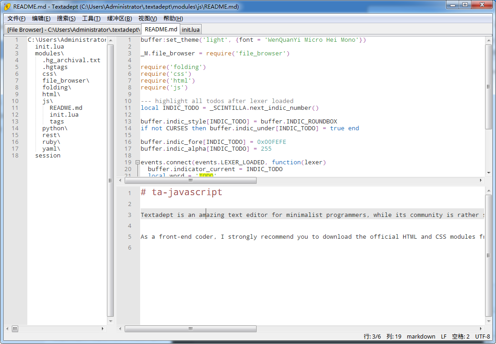

# 一款值得了解的文本编辑器，Textadept
首先我要来说为什么要介绍一款文本编辑器，我为什么会寻找一款文本编辑器。文本编辑器可以说是所有系统都会自带的一个工具，对于Windows来说自带的是记事本，对于Linux来说可能是gedit（当然Linux很多，自带的也各不相同）。文本编辑器能做的事情可少可多。对于我这样一个极简主义者来说，一个好的文本编辑器更是刚需。用它来代替一些复杂笨重的IDE或是查看工具再好不过。

## 缘起
不久之前我真正接触到了Vim的使用，感觉它真的帮到了我很多。Textadept的理念我觉得和Vim是很相似的，都是在做一个轻便易用的、但又具有很强可扩展性的文本编辑器。

如果是我的同事的话，可能知道，我最近换文本编辑器换得挺频繁的。命令行编辑我已经稳定使用Vim了，这个应该很长时间都不会变。Vim简洁、一学就会，这是我欣赏它的地方。在使用Textadept之前我先后在用Notepad++、Cudatext、Gedit。

我在Windows下，但我用了Gedit蛮长一段时间，它也昭示着我在Win下成功在Mingw64/MSYS环境下安装程序。Gedit有一个重要的好处，就是可以做到与Linux上的体验保持一致。如果你在Linux下常用Gedit编辑一般的文本文件（当然包括程序源代码）的话，我建议你试试在Win下也试试Gedit，你会有熟悉的感觉。

Gedit本身的功能很有限，而且扩展API变动频繁，前几个版本能用的插件，一更新不能用了。这是很伤感情的。虽说开源软件更新频繁也正常，但是核心用来扩展的API其实我觉得一定程度上还是要稳定一些的。大家都有自己的工作，不会总有时间去开发扩展，于是就造成最新版本能用的扩展其实就gedit包的默认的几个，以及gedit-plugins包里面为数不多的官方插件。

## Textadept
通过AlternativeTo网站，我发现了比较靠后的位置发现了Textadept。他展示的界面其实并没有太吸引我，毕竟作者选了一种灰色作为底色，不太符合大家的习惯。不过因为它打开速度快、极简以及扩展性强，还是吸引到了我。Notepad\++可以说已经是Windows上一等一的极简文本编辑器了，不过我在用Notepad\++的过程中还是感受到加载大项目的时候会有吃力。但对于如Vim一样的Textadept的File browser扩展来说，打开一个目录树不会造成太大开销。

一个优秀的编辑器不应该用户群这么小的。所以要写一篇文章来宣传一下。不过我首先把界面翻译成了中文。考虑到国人的英文水平，翻译就显得更有必要了。对于用好这款编辑器，我觉得你需要有一点探索精神。由于Lua是一个脚本语言，你在给它增加功能的时候，不需要进行任何编译，我觉得这大大降低了扩展这款文本编辑器的难度。Notepad\++我用了很久，但是我都没有主动为其写任何扩展。我觉得一个重要原因就是需要编译。编译就免不了要安一个编译器以及相关的开发环境，这我是懒得做的。可能也是我个人的口味吧，我喜欢这种上手就能写扩展的。像用Javascript为维基百科写扩展一样，不需要编译，一个浏览器就可以满足我的调试需要。

Textadept虽然社群很小，但是能看得出，玩这个的人基本都是一些会编程的。正应了官网上这句话

> Textadept is an ideal editor for programmers who want endless extensibility without sacrificing speed or succumbing to code bloat and featuritis.

Textadept小巧，小到没有多余的功能。不过有些你会用到的功能可能也没有。如果你刚接触Textadept的话，我觉得你需要树立一个观念，那就是你下载下来的核心仅仅是一个编辑器，但也是一个努力把一个编辑器应该做的做好的编辑器。你需要的自动补全、代码折叠、代码高亮、自动缩进、多个光标编辑、窗口拆分甚至简单的编译功能，Textadept一个都没有少。

对于一个单纯文本编辑器以外的功能，就需要大家进行扩展了。用Lua写扩展有时候不需要太长的代码就能搞定。一般我们也就是要实现一些小功能，Textadept的[API](https://foicica.com/textadept/api.html)很清晰，很多编辑器的API都做不到这点。同样，编写lexer文件也是用的Lua。也就是你想要做任何扩展，懂一个Lua就行了。

在扩展Textadept的过程中，你会觉得你跟它的关系更紧密了。为了不让你刚看到这个编辑器就灰心，我有必要让你少走一些弯路。Textadept这个网站确实不太友好，有些好用的插件没有和程序文件在一起，在一个叫做Modules的链接里。只是网站上没有说清modules是干嘛的。那就由我来告诉你，这是一系列官方模块，涉及以下几种语言：

> HTML、CSS、Ruby、Python、ReST、YAML

如果这几种语言有你常用的语言的话，你不下载这个modules就亏了，因为这里面有这些语言的一些常用补全和代码片段。当然如果你完全不会用到这几门语言，我也建议你下载来学习一下，看看官方推荐怎么去写扩展。你照着这么写，到时候官方改API了，你照着他改也就行了。

还有一些已经实现的模块或函数，你都可以直接拿来用，不需要再实现一遍。他们都在[这里](https://foicica.com/wiki/textadept)。就比如一次折叠所有代码，在[这里](https://foicica.com/wiki/ta-comments)。当然如果你是Lua大牛当我没说。

总之，当Textadept是你的了，你想改什么都行了。你下载下来程序的时候会发现，Textadept的所有那些Lua源代码也好好地在那儿摆着。比如你觉得官方的代码哪里有不妥的，上手就是改掉。这比别的软件方便多了吧。别的软件你得安装一堆依赖吧，你还得配置好。而这个呢，直接改代码，重启一下就生效，立竿见影。这就是我所谓的可定制性很强。

如果你还需要一点调试功能怕找不到你的Lua代码哪儿有问题的话，建议可以用一下`ui.print(...)`这个函数，它可以允许你把输出打印到Message Buffer。我就动手写了一个JavaScript的模块，放在了[我的Github](https://github.com/AlexanderMisel/ta-javascript)上供大家使用。去Github或者Google搜一下textadept，你会发现一些大神也在使用Textadept，就比如这位的[repo](https://github.com/gabdub/ta-tweaks)把Textadept改得很现代风。

我就暂且介绍到这里，我也是刚用，可能没有一些用很久的人更有体会。用这个以后我觉得我更爱用键盘了。想用的话，就试试吧。我的配置也分享在了Github上。Textadept的中文支持不是特别好，各位如果不会配置的话，可以问我。[∎](../ "返回首页")