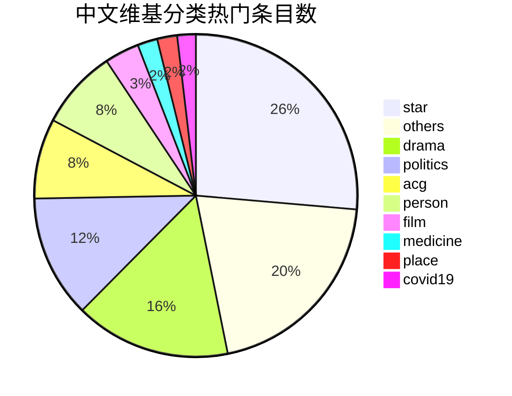

# 维基百科数据处理两则

这篇博客记录我处理维基百科数据的两次实践。想不到太好的标题，所以就用这个标题了。可能大家也发现，我在写技术博客的时候，不会只谈技术。我觉得想法是很重要的。我们程序员和其他人的差别我认为在于：能想到什么事情能编程去做，以及如果编程去做需要用到什么技术。比如我下文提到的两件事，其实说白了就是HTTP请求，再加上循环、判断处理。我大学四年没有学会如何用程序发HTTP请求，上班以后学会了，很开心。

在下面两项任务中，我都是调用维基百科的API来获取相应数据。我有一些朋友的第一思路居然会是爬网页。有API不调而去爬网页是给自己增加难度。维基百科的API我还是比较欣赏的，尤其是变量命名的一致，参数拼接方式的一致。

## 为维基百科年度热门条目分类

在维基百科上百万的条目中，每年年初都会进行排名，找到年度浏览量排名前列的条目。虽然社群以及媒体对这个列表都比较关注，但基金会每年放出这个列表的时间往往很迟，迟到让人感觉已经错过作为新闻发出来的时机。直到今年年初，我终于忍耐不住，用一个小程序在把12个月的排行前列的条目累加，得到一个近似的全年浏览量排行榜。越靠后排名越不准确，所以在公布的时候我一般都最多只公布前100名，所以准确性应该可以保证。

其实基金会是有开放数据库的，可以在网页界面查询一些过滤器啊、用户基本信息、条目基本信息（不包括条目正文），但浏览量数据库并不是一个开放的数据库，我觉得主要原因是数据量大，如果允许大家任意查询的话，基金会的土豆服务器撑不住，哈哈。另外我把12个月相加的原因也是，月度的浏览量排行是自动调接口的，但年度的结果则是由基金会统一计算好，导入到topviews的数据库里，实现年度数据的查询。之前甚至每年都需要去Phabricator（WMF在用的一种ticket系统）上请求基金会技术人员去计算。但人家是圣诞节假期，哪有心思给你算啊，所以就很迟。

无论是直接使用基金会统计的数据，还是自己累加，都会只拿到一个条目名称。我通常还希望了解条目的分类，从而了解热门条目的分布，以及某些分类中浏览量较多的条目。在前两年我都是纯手工进行分类。纯手工分类虽然准确，但也会浪费一些时间。当然，分类了两年，观察了三年，我也觉得可以尝试一下写程序进行分类了。一个很简单的原因，大家如果跟我一样关注的话应该是清楚的，维基百科浏览量排行在前列的条目每年都是那几个，就不怎么发生变化。今年唯一增加的复杂之处在于COVID-19。首先，COVID-19在今年的浏览量里有特殊地位，相关的条目不是一两个，而是一批，除了疫情本身，还有相关的人、不同国家的疫情都有条目。就像下面这张表列出的这样[^pageview_source]

| rank |           title            | views   | type           |
| ---- | :------------------------: | ------- | -------------- |
| 1    |     2019冠状病毒病疫情     | 9639339 | covid19+event  |
| 12   | 2019冠狀病毒病全球各地疫情 | 2029179 | covid19        |
| 51   |       2019冠状病毒病       | 921555  | covid19        |
| 102  |           谭德塞           | 638593  | covid19+person |
| 128  |           志村健           | 536873  | covid19+star   |
| 186  |   2019冠狀病毒病臺灣疫情   | 455327  | covid19        |
| 188  |           李文亮           | 454478  | covid19+person |
| 216  |         鑽石公主號         | 424098  | covid19        |
| 221  |       陈秋实 (律师)        | 417243  | covid19+person |
| 243  |   2019冠狀病毒病香港疫情   | 397039  | covid19        |
| 449  |   2019冠狀病毒病美國疫情   | 262775  | covid19        |
| 461  | 2019冠狀病毒病馬來西亞疫情 | 257657  | covid19        |
| 528  |   2019冠狀病毒病日本疫情   | 234145  | covid19        |
| 535  |  2019冠状病毒病意大利疫情  | 231108  | covid19        |
| 628  |   2019冠狀病毒病韓國疫情   | 196579  | covid19        |

我没有用到机器学习的算法，而是把它当作是一个普普通通的业务来写的。当然这得益于维基百科的分类网。在维基百科中，维基人会主动为条目加上分类，这些分类是人工加的，相当于我们的数据已经是带了标签的，这些标签对我分类有很大帮助。虽然我不是不能直接用这些标签，但我是通过这些标签中的关键字来识别对应条目的类别的。这些关键字也是我调试的一个重点，大致是下面这样的：

```lua
local cat_type = {
  { '演员#', 'star' }, { '歌手#', 'star' }, { '音乐团体', 'star' },
  { '年出生', 'person' }, { '年逝世', 'person' },
  { '城市#', 'place' },  { '国家#', 'place' }, { '政权#', 'place' }, { '共和国#', 'place' }, { '成员国#', 'place' }, 
  { '节日#', 'festival' }, { '主题日#', 'festival' },
  { '事件#', 'event' }, { '案件#', 'event' }, { '事故#', 'event' },
  { '网站#', 'website' }
}

local cat_topic = {
  { '电视剧', 'drama' }, { '剧集', 'drama' },
  { '漫画', 'acg' }, { '动画', 'acg' }, { '游戏#', 'acg' }, { '角色列表', 'acg' },
  { '电影#', 'film' },
  { '色情', 'porn' }, { '性行为', 'porn' }, { '%f[%a]AV%f[%A]', 'porn' }, 
  { '党', 'politics' }, { '中共', 'politics' }, { '政治', 'politics' }, { '选举', 'politics' },
  { '军事', 'military' }, { '战争#', 'military' }, { '战役#', 'military' },
  { '真人秀', 'show' }, { '综艺', 'show' }, { '选秀', 'show' }, { '娱乐节目', 'show' }, 
  { '冠状病毒病', 'covid19' },
  { '病', 'medicine' }, { '药', 'medicine' },
}
```

我使用了两个层级的关键词，`cat_type`这个匹配会告诉我条目是什么类型的事物，`cat_topic`这个匹配会告诉我条目的主题是关于什么的。当然仅仅这样匹配，谁都会想到，会有错误划分。需要一些修正。我目前的修正仅仅是排除了带有下面两个关键词的分类：

```lua
local exclusion = { '党员', '校友' }
```

修正出现错误结果之后才会有的。为什么是这两个分类？因为我发现很多明星被标注成了“politics+star”，我认为这不正常，于是我找了几个样本看了一下，发现他们的分类是XX年入党的党员。我想党员不能说就跟政治挂钩，所以我要排除它。第二个修正“校友”，是因为我发现一个人可能是XX政治大学的校友，但他不能算作politics分类。

其实我还发现有意思的事情，就是“show+star”和“show+person”分类，为什么一个人还可以是show，再仔细分析之后，我发现这些几乎都是主持过综艺节目的人。所以我没有直接处理掉。数据稍加整理就可以做出类似下图这样的图表



可以看出中文维基的热门条目主要是明星、电视剧、政治、ACG和热点人物，这就是我说的历年不变的东西。COVID-19今年虽然挤进来了，但条目数量上不会占优势，当然占优势也就麻烦了，那样COVID-19影响面就太广了。

## 获取科学方面的条目

我一直有一个想法，就是通过维基百科的社群让大家更加了解和热爱科学。中文维基百科人文当道。也许我上面说的这句话不完全正确，但从我这个角度看，确实能感受到这一点。这或许与你们一部分人的认知不太一样。因为中国大陆的大家或许之所以听说维基百科，在用维基百科，也许就是听说维基百科的数理化条目比较强，深入但又好懂。

由于近年来某个阻碍越来越严重，可能能在大陆继续使用维基百科的，有一大批是我国的科技人才或者未来的科技人才。从我作为程序员看，我们领域中还算听说过维基百科的，可能比别的行业要多一些。但我的同行们对维基百科科技条目的贡献率让我失望。他们反而会去贡献那些人文条目，或者社会热点之流。当然我没有说贡献人文条目有问题，但是如果自己专业领域条目无人贡献的话，别人就更不会贡献了。

背景就说这么多。我的目标就是把维基百科的科学相关的条目摘要拿出来，作为群机器人推送条目的来源。我之前有过获取热门条目的经验，所以这个小目标其实是水到渠成的。因为在之前获取热门条目的代码编写过程中，我用到了异步发HTTP请求这方便的知识，并且有了尝试的经验。在写这个的时候，我直接就上异步，因为我知道同步请求有多慢。关于Lua异步请求方面，可以看我[另一篇博客](./copas-and-lua-async.html)。

我在这篇要主要介绍的是我的思路，以及在一些细节上的处理。上文提到了，维基百科的分类是网状结构的，并非是树状结构，分类与分类交织在一起，一个分类可以有多个父分类和多个子分类。直接上手去顺着分类摸，被前人证明是愚蠢的事情，容易摸到一个无关的父分类。并不是维基人加分类时不用心，而是维基的分类结构如此，维基人在一个底层条目加分类的时候，不会去考虑上层要经过什么样的路径才能到达一个基础分类。

还好我是一个还算了解维基百科的人，所以不会走这条路。我知道另一条路。它位于维基百科的条目的讨论页。维基百科不光条目有分类，讨论页也有分类。有时候讨论页的分类比条目的分类还好用。我想说的就是“维基专题”相关的分类，它们是通过条目评级模板加入的。根据我的了解，有些维基人非常热爱给条目评级，或许因为这是一个不需要写条目就可以刷编辑数的办法。[^editcount]

我选了这些分类作为数据来源。

```lua
local sci_cats = {
  '极高重要度数学条目', '高重要度数学条目', '中重要度数学条目',
  '极高重要度物理学条目', '高重要度物理学条目', '中重要度物理学条目',
  '极高重要度化学条目', '高重要度化学条目', '中重要度化学条目',
  '极高重要度生物学条目', '高重要度生物学条目', '中重要度生物学条目',
  '极高重要度医学条目', '高重要度医学条目', '中重要度医学条目',
  '极高重要度电脑和信息技术条目', '高重要度电脑和信息技术条目', '中重要度电脑和信息技术条目',
}
```

这几个分类非常顶用，从中能够拿到上万个条目，而且质量令人满意。有了条目名称，就需要获取摘要了。维基百科有两套API都能查条目的摘要，一种是RESTful的，一种是普通的URI参数的。可以说RESTful是相当好理解的，我之前获取每日热门条目的摘要就是用这套。但是苦在两点，一是每次请求只支持查一个条目，二是返回格式没得选，返回啥就只能认啥。

反观老式的api.php版接口，提供了HTML形式和plaintext格式的extract，摘要限制多长，摘要返回多少句话，多少个字符都可以控制。虽然，基金会在这方面处理的很垃圾，但至少灵活了。在灵活的基础上我就可以自己写处理函数了，自己处理HTML。我自己写处理函数的原因还有一个，那就是基金会在处理含有数学公式的摘要方面有硬伤，会导致格式混乱。在群友那里反馈也不好。下面就是我写的处理函数，也是我比较骄傲的地方：

```lua
function stripHtmlTags(extract)
  if not extract then return '' end
  local first_para = extract:match('<p>(.-)\n?</p>')
  if not first_para then return '' end
  first_para = first_para:gsub('<span><span><math.-alttext="(.-)".-</span></span>', 
                function(p1)
                  return p1:gsub('%b{}', function (p2)
                    return p2:gsub('^{\\displaystyle (.-)}$', function (p3)
                      if p3:match('^%b{}$') then
                        return '$' .. p3:gsub('^{(.*)}$', '%1') .. '$'
                      else
                        return '$' .. p3 .. '$'
                      end
                    end)
                  end)
                end)
  first_para = first_para:gsub('%b<>', '')

  for uchar, end_pos in first_para:gmatch('([%z\1-\127\194-\244][\128-\191]*)()') do
    if uchar == '。' or uchar == '：' then
      if end_pos > 450 then
        first_para = first_para:sub(1, end_pos - 1)
        break
      end
    end
  end
  return first_para
end
```

我把公式干干净净地去得只剩下一个LaTeX表达式，符合那些学术狗的口味。缺少公式的科学条目会影响阅读的，所以必须留着。HTML标签也使用Lua专属的`%b<>`模式匹配轻松去掉了。

我之所以最近写这个是因为我最近修复了这个程序的一点小问题。这个小问题跟URL Encode有关。以后如果GET请求导致后端报错，浏览器上却正常的话，可以考虑一下把含有中文的参数encode一下。浏览器是默认encode的，但你的程序如果不主动进行这个编码，或者用的库比较底层，可能并未encode。另外我还做了失败重发的操作，在网络条件不好的情况下，失败重发还是挺管事的。[∎](../ "返回首页")

[^pageview_source]: 数据来自2020年1-7月的浏览量
[^editcount]: 也许不是维基人的你们无法理解，在维基百科上，编辑数就是能力的重要代表，就是话语权。如果你没编过几个条目，你就开始对维基百科指手画脚的话，能够想象在站内没什么人会搭理你。

